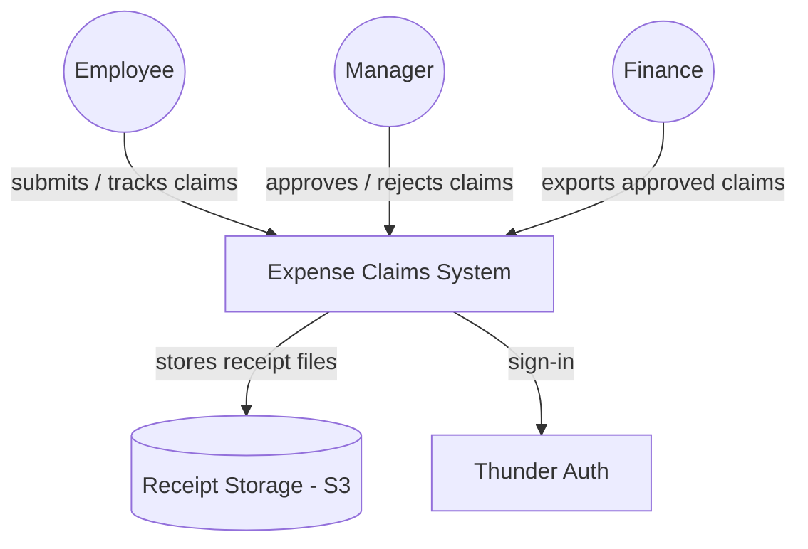
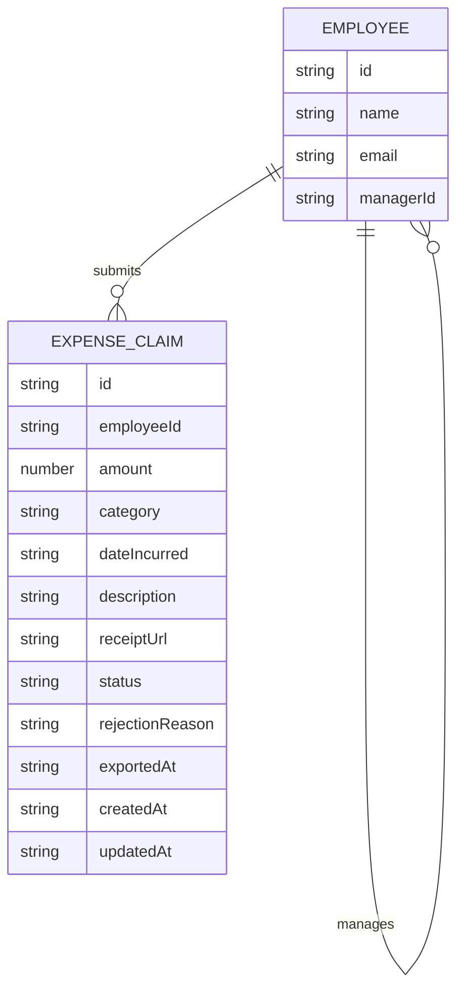
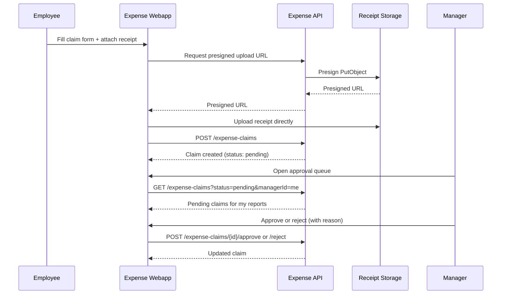
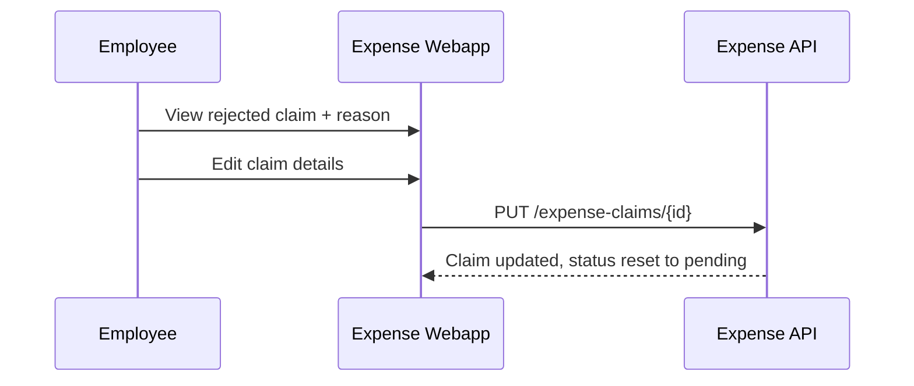
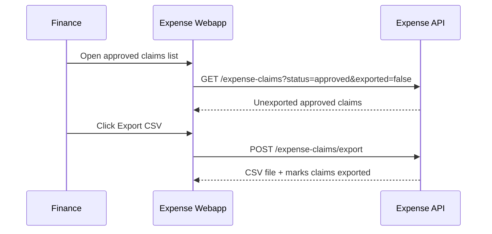

# Expense Claims — Design

Employees submit expense claims with a receipt through the Expense Claims
Portal; the Expense Claims API stores claims, routes each one to the
employee's designated manager for approval, and lets finance export approved
claims as a payroll-ready CSV. Receipts are stored in object storage, and
sign-in for all three roles is handled by the platform identity provider.

## Context (C1)

## Domain model (ER)

`status` is one of `pending`, `approved`, `rejected`. `category` is one of
Travel, Meals, Lodging, Office Supplies, Other. `exportedAt` is set once
finance includes the claim in a CSV export.

## Key flows

### Submit and approve a claim

### Resubmit a rejected claim

### Export approved claims to payroll

